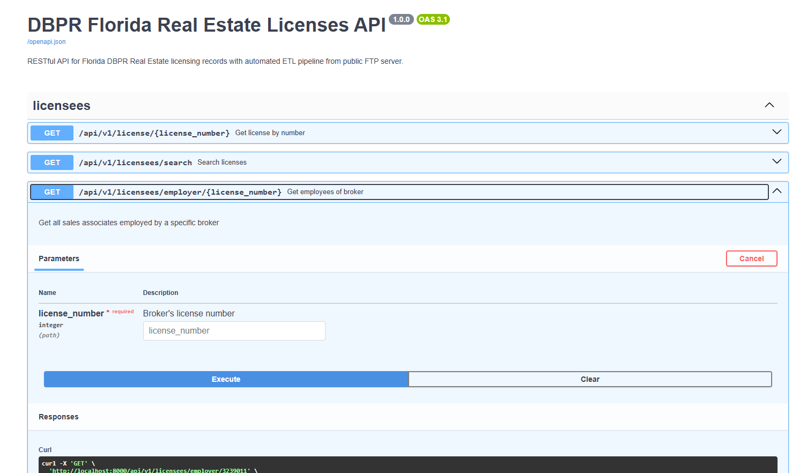

# dbpr_fl
a complete RESTful API for Florida's DBPR Real Estate Licensing records


# DBPR

Florida's real estate licensing authority is the [Department of Business and Professional Regulation](https://www2.myfloridalicense.com/real-estate-commission/public-records/), or "DBPR". This entity oversees the publicly available information about the status and details of all professional and business licenses issued by the State of Florida, including Real Estate agents, brokers, and accredited instructors. Information on an individual license is available [at a web interface](https://www.myfloridalicense.com/wl11.asp?mode=2&search=LicTyp&SID=&brd=&typ=) on their main website, but this doesn't allow one to evaluate multiple licensee's data at the same time. For this purpose, DBPR regularly (about 2-3 times a week on average) publishes a complete, current set of licensee data to a public server.

These files contain most of the information needed to create a truly useful API interface from the dataset, and also reveal a rich source of data we can leverage to create some more general functions and code snippets related to Florida place names, address formatting, and more.
<br>

# Goals and Objectives
We will use a combination of technologies to normalize and wrangle the dataset, but our stack will mostly consist of:
- 🐍 Python - for infrastructure and moving things around
- 🦆 DuckDB - for initial data introspection, storage, and conversion
- 🐻‍❄️ Polars - for more complex transformations and analysis via Dataframes

### Data Acquisition & Storage
* ✅ **Automated CSV fetching** - Python FTP downloader with 24-hour scheduling via APScheduler
  - Change detection via file modification timestamps
  - Retry logic and verification built-in
  - Downloads only when updates are available

* ✅ **Parquet archival with timestamps** - Compressed long-term storage implemented
  - Each ETL run creates timestamped ~20MB Parquet file (e.g., `dbpr_20250109_143022.parquet`)
  - ZSTD compression for optimal size/speed balance
  - Serves as point-in-time snapshots for historical reference

* ✅ **Data normalization and enumeration** - All repetitive data identified and indexed
  - Board names (6 types)
  - Rank codes (8 types) 
  - Primary statuses (5 types)
  - States/territories (67 entries)
  - Counties (67 FL counties + Out of State + Foreign)
  - Cities (table ready for ~500 normalized names)

### Database Infrastructure
* ✅ **DuckDB schema initialization** - Complete SQL schema with all tables, indexes, and views
  - Normalized enumeration tables
  - Main `licensees` table with proper types and constraints
  - Denormalized `licensees_full` VIEW for easy querying
  - Schema version tracking

* ✅ **Python database manager** - Full connection management with dual instances
  - Read-only instance for API queries
  - Read-write instance for ETL operations
  - Context managers for safe operations
  - Helper methods for common tasks

### Data Processing Pipeline
* ✅ **CSV → Polars → DuckDB pipeline** - Direct transformation without intermediate JSON
  - **Decision: Skipped JSON intermediary** - Polars DataFrames are more efficient
  - Reads headerless CSVs with proper schema
  - Type conversions and enum mapping in-memory
  - Generates computed fields (alternate_license_number, flags)
  - Validates data quality before loading

* ✅ **Upsert functionality** - Intelligent INSERT ON CONFLICT DO UPDATE
  - New licenses: INSERT with created_at
  - Existing licenses: UPDATE changed fields, preserve created_at
  - Batch processing for performance (~3,000-5,000 records/sec)
  - Data integrity verification after load

### Logging & Observability
* ✅ **Comprehensive logging** - Loguru-based logging throughout all components
  - Console output with color formatting
  - Rotating file logs with compression
  - Separate log files by date
  - Configurable log levels
  - Exception tracking with stack traces

### API & Management
* ✅ **FastAPI REST API** - Complete API with auto-generated documentation
  - Single license lookup
  - Search with filters and pagination
  - Employer relationship queries
  - Expiring licenses endpoint
  - Statistics and health checks
  - Admin ETL control endpoints

* ✅ **CLI management tool** - Comprehensive command-line interface
  - Database initialization
  - ETL pipeline control (normal and forced)
  - System health checks
  - Statistics reporting
  - City mappings loader (awaiting data)

* ✅ **Docker deployment** - Production-ready containerization
  - Dockerfile with optimized layers
  - Docker Compose with volume persistence
  - Health checks and restart policies
 

## Update 10/9/2025:
I've completed protptyping on the entire pipeline and it builds, works, ingests, serves the API, etc. Broadly speaking the goals above have been met. However, before releasing the initial code I need to do a comprehensive analysis of the dataset and implement a LOT of subtle fixes in the ETL pipeline to deduplicate properly and handle MANY known and unknown special cases in the ~465,000 rows of data. The following is a list of known tweaks I (potentially) still need to make before release. I've added several introspection scripts to the repo that demonstrate the kind of work I'm now doing to make sure the majority of known quirks are handled silently and permanently. To use them as-is you'll need the 14 raw DBPR `.csv` files in a directory `data/raw` relative to the script and `cities_valid.json` file. Try them for yourself and let me know if you find anything notable! 

## 🔍 Data Quality Analysis & Documentation

### Analyze Known Data Quirks
- [ ] **"Z" prefix licenses investigation**
  - [ ] Analyze distribution of "ZH RE Instructor" vs "ZH Add Sch Loc"
  - [ ] Document whether they share license number sequences
  - [ ] Verify alternate_license_number generation handles both correctly
  - [ ] Add findings to README or separate DATA_NOTES.md

- [ ] **Instructor license patterns**
  - [ ] Count instructors vs other license types
  - [ ] Identify any special handling needed for instructor addresses
  - [ ] Check if instructors have different expiration patterns
  - [ ] Document instructor-specific business rules

- [ ] **Employer relationship data quality**
  - [ ] Count licenses with employers_license_number populated
  - [ ] Verify referential integrity (do all employer IDs exist?)
  - [ ] Identify orphaned employer relationships
  - [ ] Document expected vs actual relationship patterns

- [ ] **Address data anomalies**
  - [ ] Find and document problematic city name variations
  - [ ] Identify addresses with unusual formats
  - [ ] Check for common data entry errors (e.g., "LAUDERDALE BYTHE SEA")
  - [ ] Document zip code patterns (5-digit vs 9-digit)

- [ ] **Date field analysis**
  - [ ] Identify licenses with expiration dates in the past but status "Current"
  - [ ] Find outlier original_license_dates (very old or suspiciously new)
  - [ ] Check for impossible date combinations
  - [ ] Document acceptable date ranges

- [ ] **Status combinations analysis**
  - [ ] Document all observed primary_status + secondary_status combinations
  - [ ] Identify unusual or impossible status combinations
  - [ ] Verify current_and_active flag accuracy
  - [ ] Verify attention_needed flag covers all intended cases

### Geographic Data Analysis
- [ ] **County code validation**
  - [ ] Find any county codes in data not in enumeration table
  - [ ] Document "Out of State" vs "Foreign" distribution
  - [ ] Identify most common out-of-state locations

- [ ] **State code validation**
  - [ ] Find any state codes in data not in enumeration table
  - [ ] Document foreign country representation
  - [ ] Check for state/county mismatches

- [ ] **City normalization needs**
  - [ ] Generate complete list of unique city values from database
  - [ ] Compare against cities_valid.json (412 cities)
  - [ ] Identify cities needing manual mapping
  - [ ] Document city variants for fuzzy matching

### Statistical Profiling
- [ ] **Generate comprehensive data profile**
  - [ ] NULL value percentages for each column
  - [ ] Unique value counts for each column
  - [ ] Distribution of licenses by rank type
  - [ ] Distribution by primary status
  - [ ] Distribution by secondary status
  - [ ] Geographic distribution (top counties, cities)
  - [ ] Expiration date distribution

- [ ] **Create data quality report**
  - [ ] Document in `docs/DATA_QUALITY_REPORT.md`
  - [ ] Include sample queries for common data issues
  - [ ] Add recommendations for data cleaning

<br>
<br>

# DBPR CSV Column Overview

Let's begin looking at the dataset. The DBPR dataset consists of 14 large `.csv` files available via public FTP at:
```
ftp://dbprftp.state.fl.us/pub/llweb/
```

The files are organized and labeled in that directory by region:
`RE_rgn1.csv`, `RE_rgn2.csv`, `RE_rgn3.csv` ... `RE_rgn14.csv`.  The files have varying row counts, with a total combined row count of about `~465,000` rows in all files as of `08-22-2024`
<br>

Each DBPR `.csv` licensee file is a headerless comma-separated value file with 23 columns in `ASCII` format. We will assign header labels in column order as follows:

```json
"board"
"board_name"
"licensee_name"
"dba_name"
"rank_code"
"address_1"
"address_2"
"address_3"
"city"
"state_code"
"zip_code"
"county_code"
"county_name"
"license_number"
"primary_status"
"secondary_status"
"original_license_date"
"status_effective_date"
"license_expiration_date"
"alternate_license_number"
"self_proprietors_name"
"employers_name"
"employers_license_number"
```

Below are brief descriptions of each column in the data set, what the values mean, how they relate to each other, and some of our initial strategies and assumptions related to potential storage and compression of the ingested data in its native state.
<br>

Note that we've decided to define all "native" values from the files as `string` values; while some fields (like `board`, as noted directly below) could reasonably be ingested/interpreted as `int` or some other type, little to no performance gain is made, and future errors in the csv files, if any, will be handled more consistently if we just treat everything as a `string` on-ingestion.
<br>

These column descriptions are identical across all 14 files, and are used interchangably as descriptors of the column in individual `csv` files, the value as we transform it, and as column labels in the `DuckDB SQL` schema for the whole DB. 


# Column List

## `board`
- is natively ALWAYS a string with the value `"25"`
- cannot be null.
- stored as a `GENERATED` value `25` of type `TINYINT`
```jsonc
// board example:
native value: "25"
db value: {25}  // generated value
```
<br>


## `board_name`
- is natively a string which always contains one of the enumerated values.
- cannot be null.
- is stored as a `BIGINT` enumerated/mapped as follows:
```jsonc
// board_name example:
native value: "2501 Real Estate Broker or Sales"
db value: 2501
```
🗒️Note: To get the original string for `board_name`, we combine the stored `BIGINT` and the corresponding string value
<br>
<br>


## `licensee_name`
- is natively a string with an observed limit of `64` characters. 
- cannot be null.
- stored as a `VARCHAR` with a limit of `64` characters.
```jsonc
// licensee_name example:
native value: "Joe Smith"
db value: "Joe Smith"
```
<br>


## `dba_name`
- is natively a string with an observed limit of `64` characters. 
- can be null.
- stored as a `VARCHAR` with a limit of `64` characters. 
```jsonc
// dba_name example:
native value: "Joe Smith Realty, Inc"
db value: "Joe Smith Realty, Inc"
```
<br>


## `rank_code`
- is natively a string which always contains exactly one of the enumerated values.
- NOT labeled `rank` intentionally; using `rank_code` prevents collisions with `SQL` verbs.
- can be used as a proxy to enumerate/construct several other column values
- map value to an `id` key as follows, where the native csv string value is mapped to `"rank"`
- stored as `TINYINT` by its `id` in the database.
- TODO: change internal labels!
```jsonc
// rank_code example:
native value: "SL Sales Associate"
db value: 6
```
🗒️Note: The original `csv` string value is stored as `rank_code.rank`
<br>
<br>


## `address_1`
- is natively a string with an observed limit of `48` characters. 
- cannot be null.
- stored as a `VARCHAR` with a limit of `64` characters.
```jsonc
// address_1 example:
native value: "123 Elm ST"
db value: "123 Elm ST"
```
<br>


## `address_2`
- is natively a string with an observed limit of `40` characters.
- can be null.
- stored as a `VARCHAR` with a limit of `64` characters.
```jsonc
// address_2 example:
native value: "123 Elm ST"
db value: "123 Elm ST"
```
<br>


## `address_3`
- is natively a string with an observed limit of `40` characters.
- can be null and blank values are nullable.
- stored as a `VARCHAR` with a limit of `64` characters.
```jsonc
// address_3 example:
native value: "123 Elm ST"
db value: "123 Elm ST"
```
<br>


## `city`
- is natively a string with an observed limit of `24` characters.
- cannot be null TODO: (?)
- stored as a `VARCHAR` with a limit of `64` characters.
- TODO: presents opportunity for enumeration? only ~32k unique values in-db including misspellings
```jsonc
// city example:
native value: "Miami"
db value: "Miami"
```
<br>


## `state_code`
- is natively a string with an observed limit of `2` characters.
- cannot be null TODO: (confirm?)
- NOT labeled `state` intentionally; using `state_code` prevents collisions with `SQL` verbs.
- is enumberable as a JSON struct value mapped to the value passed, which we can enhance at very little cost to be more useful by storing proper State strings mapped to values as shown; this lets us retrieve the abbreveiation OR the longform string for the `state_code` column.
```jsonc
// state_code example:
native value: "FL"
db value: "FL"
```
<br>


## `zip_code`
- is natively a string with an observed limit of `10` characters.
- NOT labeled `zip` intentionally; using `zip_code` prevents collisions with `SQL` and `Python` verbs
- should only contain numbers and (possibly) a dash `-`, either: `12345` or `12345-7890`
- cannot be null TODO: (confirm?)
- stored as a `VARCHAR` with a limit of `10` characters.
- TODO: presents enumeration opportunity related to `city`
```jsonc
// zip_code example:
native value: "12345-7890"
db value: "12345-7890"
```
<br>


## `county_code`
- is natively a string with an observed limit of `3` characters.
- should only contain numbers
- cannot be null TODO: (?)
- stored as `BIGINT`
- enumerated as follows: the `county_code` is in a single list, and the `county_name` is the key that refers to the list containg that `county_code` as a value.
```jsonc
// county_code example:
native value: "702"
db value: 702
```
<br>


## `county_name`
- is natively a string with an observed limit of `16` characters.
- cannot be null TODO: (?)
- is stored as an enumerated (generated?) `VARCHAR` value mapped to the value of `county_code`
- see "Enumeration for `county_name` and `county_code` mapping" in `county_code` above
```jsonc
// county_name example:
native value: "Alachua"
db value: {row.county_code.name}  // generated value
```
<br>


## `license_number`
- is natively a string with an observed limit of `7` characters.
- should only contain numbers
- is a unique identifier within the native csv data TODO: caveats?
- stored as an `INTEGER` with up to 7 digits
```jsonc
// license_number example:
native value: "1234567"
db value: 1234567
```
<br>


## `primary_status`
- is natively a string which always contains exactly one of the enumerated values.
- cannot be null TODO: (confirm?)
- stored as an enumerable with one of the following string values: 
```jsonc
// primary_status example:
native value: "Current"
db value: {Current}
```
<br>


## `secondary_status`
- is natively a string or `null` which always contains exactly one of the enumerated values.
- stored as a `BOOLEAN` where `"Active" == True` and `"Inactive" == False`, `null` is also valid 
```jsonc
// secondary_status example:
native value: "Active"
db value: true
```
<br>


## `original_license_date`
- is natively a string which always contains a date in `'%m/%d/%Y'` format
- stored as a `DATE` ingested via `'%m/%d/%Y'` format
```jsonc
// original_license_date example:
native value: "01/01/2010"
db value: {duckdb.date("01/01/2010", "%m/%d/%Y")}  // uses DuckDB DATE
```
<br>


## `status_effective_date`
- is natively a string which always contains a date in `'%m/%d/%Y'` format
- stored as a `DATE` in `'%m/%d/%Y'` format
```jsonc
// status_effective_date example:
native value: "01/01/2010"
db value: {duckdb.date("01/01/2010", "%m/%d/%Y")}  // uses DuckDB DATE
```
<br>


## `license_expiration_date`
- is natively a string which always contains a date in `'%m/%d/%Y'` format
- stored as a `DATE` in `'%m/%d/%Y'` format
```jsonc
// license_expiration_date example:
native value: "01/01/2010"
db value: {duckdb.date("01/01/2010", "%m/%d/%Y")}  // uses DuckDB DATE
```
<br>


## `alternate_license_number`
- is natively a string with an observed limit of `9` characters which always contains a prefix and the `license_number`
- if we refer to the `rank_code` field and note the `"alt_lic_prefix"` value in that structure, the `alternate_license_number` value is a `VARCHAR` with a limit of 9 characters which is generated by combining the string values for `rank.alt_lic_prefix` and `license_number` to get something like: `"SL1234567"`
```jsonc
// alternate_license_number example:
native value: "SL1234567"
db value: {get_alt_lic_num("license_number", "rank_code")}  // generated value
```
<br>


## `self_proprietors_name`
- is natively a string with an observed limit of `64` characters. 
- can be null.
- stored as a `VARCHAR` with a limit of `64` characters.
```jsonc
// self_proprietors_name example:
native value: "Joe's RE"
db value: "Joe's RE"
```
<br>


## `employers_name`
- is natively a string with an observed limit of `64` characters. 
- can be null.
- stored as a `VARCHAR` with a limit of `64` characters.
```jsonc
// employers_name example:
native value: "Jim's RE"
db value: "Jim's RE"
```
<br>


## `employers_license_number`
- is natively a string with an observed limit of `64` characters. 
- can be null.
- stored as a `VARCHAR` with a limit of `64` characters.
```jsonc
// employers_license_number example:
native value: "1234567"
db value: 1234567
```

### (end Column Descritiptions section)
<br>


# Enumerations and Mappings

## `board_name` enumeration
- this data was sourced directly from the `csv` values.
```jsonc
// enumeration for board_name
[
    {"2501": "Real Estate Broker or Sales"},
    {"2507": "Real Estate Additional Location"},
    {"2504": "Real Estate Branch Office"},
    {"2503": "Real Estate Partnership"},
    {"2505": "Real Estate Instructor"},
    {"2502": "Real Estate Corporation"}
]
```

## `rank_code` enumeration
- this data was sourced directly from the `csv` values.
```jsonc
// enumeration for rank_code
{
    "name": "Broker", 
    "rank": "BK Broker", 
    "alt_lic_prefix": "BK", 
    "id": 1, 
}, 
{ 
    "name": "Broker Sales", 
    "rank": "BL Broker Sales", 
    "alt_lic_prefix": "BL", 
    "id": 2,
}, 
{ 
    "name": "RE Branch Offic", 
    "rank": "BO RE Branch Offic", 
    "alt_lic_prefix": "BO", 
    "id": 3, 
}, 
{ 
    "name": "RE Corp.", 
    "rank": "CQ RE Corp.", 
    "alt_lic_prefix": "CQ", 
    "id": 4, 
    }, 
{ 
    "name": "RE Partnership", 
    "rank": "PR RE Partnership", 
    "alt_lic_prefix": "PR", 
    "id": 5,
}, 
{ 
    "name": "Sales Associate", 
    "rank": "SL Sales Associate", 
    "alt_lic_prefix": "SL", 
    "id": 6, 
}, 
{ 
    "name": "RE Instructor", 
    "rank": "ZH RE Instructor", 
    "alt_lic_prefix": "ZH", 
    "id": 7, 
}, 
{ 
    "name": "Add Sch Loc", 
    "rank": "ZH RE Instructor", 
    "alt_lic_prefix": "ZH", 
    "id": 8, 
}
```


## `county_name` and `county_code` mapping
- this data was sourced directly from the `csv` values.
```jsonc
// enumeration/mapping for county_name and county_code
{
"Alachua": ["11"],
"Baker": ["12"],
"Bay": ["13"],
"Bradford": ["14"],
"Brevard": ["15"],
"Broward": ["16"],
"Calhoun": ["17"],
"Charlotte": ["18"],
"Citrus": ["19"],
"Clay": ["20"],
"Collier": ["21"],
"Columbia": ["22"],
"Dade": ["23"],
"DeSoto": ["24"],
"Dixie": ["25"],
"Duval": ["26"],
"Escambia": ["27"],
"Flagler": ["28"],
"Franklin": ["29"],
"Gadsden": ["30"],
"Gilchrist": ["31"],
"Glades": ["32"],
"Gulf": ["33"],
"Hamilton": ["34"],
"Hardee": ["35"],
"Hendry": ["36"],
"Hernando": ["37"],
"Highlands": ["38"],
"Hillsborough": ["39"],
"Holmes": ["40"],
"Indian River": ["41"],
"Jackson": ["42"],
"Jefferson": ["43"],
"Lafayette": ["44"],
"Lake": ["45"],
"Lee": ["46"],
"Leon": ["47"],
"Levy": ["48"],
"Liberty": ["49"],
"Madison": ["50"],
"Manatee": ["51"],
"Marion": ["52"],
"Martin": ["53"],
"Monroe": ["54"],
"Nassau": ["55"],
"Okaloosa": ["56"],
"Okeechobee": ["57"],
"Orange": ["58"],
"Osceola": ["59"],
"Palm Beach": ["60"],
"Pasco": ["61"],
"Pinellas": ["62"],
"Putnam": ["64"],
"Santa Rosa": ["67"],
"Sarasota": ["68"],
"Seminole": ["69"],
"Saint Johns": ["65"],  // "St" changed to "Saint" intentionally
"Saint Lucie": ["66"],  // "St" changed to "Saint" intentionally
"Sumter": ["70"],
"Suwannee": ["71"],
"Taylor": ["72"],
"Union": ["73"],
"Unknown": ["99"],
"Volusia": ["74"],
"Wakulla": ["75"],
"Walton": ["76"],
"Washington": ["77"],
"Foreign": ["80", "801", "802", "803", "812", "816"],
"Out of State": [ "701", "702", "703", "704", "705", "706", "707", "708", "709", "710", "711", "712", "713", "714", "715", "716", "717", "718", "719", "720", "721", "722", "723", "724", "725", "726", "727", "728", "729", "730", "731", "732", "733", "734", "735", "736", "737", "738", "739", "740", "741", "742", "743", "744", "745", "746", "747", "748", "749", "750", "751", "752", "753", "759", "760", "79"]
}
```

## `county_name` and `county_code` mapping
- These values from [the USPS](https://pe.usps.com/text/pub28/28apb.htm)
```jsonc
// enumeration for state + proper string values
{
    "-": "Unknown",
    "99": "International",
    "AA": "Armed Forces Americas",
    "AB": "Alberta",
    "AE": "Armed Forces Europe",
    "AK": "Alaska",
    "AL": "Alabama",
    "AP": "Armed Forces Pacific",
    "AR": "Arkansas",
    "AS": "American Samoa",
    "AZ": "Arizona",
    "BC": "British Columbia",
    "CA": "California",
    "CO": "Colorado",
    "CT": "Connecticut",
    "DC": "District of Columbia",
    "DE": "Delaware",
    "FA": "Foreign Address",
    "FE": "Foreign Entity",
    "FL": "Florida",
    "FM": "Federated States of Micronesia",
    "FP": "Foreign Province",
    "GA": "Georgia",
    "GU": "Guam",
    "HI": "Hawaii",
    "IA": "Iowa",
    "ID": "Idaho",
    "IL": "Illinois",
    "IN": "Indiana",
    "KS": "Kansas",
    "KY": "Kentucky",
    "LA": "Louisiana",
    "MA": "Massachusetts",
    "MB": "Manitoba",
    "MD": "Maryland",
    "ME": "Maine",
    "MH": "Marshall Islands",
    "MI": "Michigan",
    "MN": "Minnesota",
    "MO": "Missouri",
    "MS": "Mississippi",
    "MT": "Montana",
    "NB": "New Brunswick",
    "NC": "North Carolina",
    "ND": "North Dakota",
    "NE": "Nebraska",
    "NH": "New Hampshire",
    "NJ": "New Jersey",
    "NL": "Newfoundland and Labrador",
    "NM": "New Mexico",
    "NP": "Northern Mariana Islands",
    "NS": "Nova Scotia",
    "NT": "Northwest Territories",
    "NU": "Nunavut Territory",
    "NV": "Nevada",
    "NY": "New York",
    "OH": "Ohio",
    "OK": "Oklahoma",
    "ON": "Ontario",
    "OR": "Oregon",
    "PA": "Pennsylvania",
    "PE": "Prince Edward Island",
    "PR": "Puerto Rico",
    "PW": "Palau",
    "QC": "Quebec",
    "RI": "Rhode Island",
    "SC": "South Carolina",
    "SD": "South Dakota",
    "SK": "Saskatchewan",
    "TN": "Tennessee",
    "TX": "Texas",
    "UT": "Utah",
    "VA": "Virginia",
    "VI": "Virgin Islands",
    "VT": "Vermont",
    "WA": "Washington",
    "WI": "Wisconsin",
    "WV": "West Virginia",
    "WY": "Wyoming",
    "YT": "Yukon Territory"
}
```


## `primary_status` enumeration
- this data was sourced directly from the `csv` values.
```jsonc
// enumeration for primary_status
["Probation",  "Current", "Suspended", "Delinquent", "Invol Inactive"]
```


## `secondary_status` enumeration
- this data was sourced directly from the `csv` values.
```jsonc
// enumeration for secondary_status
["Active", "Inactive", null]
```
